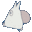

Please don't use for commercial purposes. Please use only by yourself.


## Contents

- [Install](#install)
- [Usage](#usage)
- [Options](#options)
- [Available Themes](#available-themes)
- [License](#license)

## Install

### Using the plugin manager - `hyper`

Firstly, ensure you have [Hyper](https://github.com/zeit/hyper/releases) installed in your system.

Once done with that, install the `hyper-totoro` theme.

```bash
# fire up a terminal and type 
$ git clone https://github.com/shunitoh/hyper-totoro.git ~/.hyper_plugins/local/hyper-totoro
```

### Manually through `.hyper.js`

Add `hyper-totoro` to the plugins list in your `~/.hyper.js` config file and restart Hyper.

```js
...
localPlugins: ['hyper-totoro'],
...
```

## Usage

Once you have installed `hyper-totoro`, it's time to set your favorite theme.

Go to your `~/.hyper.js` and add the `totoro` option below the `colors` object, and define your theme of choice.

Here is a quick example, where we choose the `dark` theme,   
with a `unibody` color for the window header & dark terminal tabs. 

```js
config: {
    //...
    colors: {
    //...
    },
    totoro: 'dark', // Choose your favorite pokemon theme
    unibody: 'true', // Choose the color of the window header
    totorotab: 'true', // activate your theme's totorotab
    //...
}
```

## Options
### `totoro`

- `totoro`: 'dark' - choose it for character color theme

### `unibody`

Choose whether or not you want the Hyper windows header color to be the same as the background theme.
The assignable values are:

- `unibody: 'true'` - choose it for a unibody color theme
- `unibody: 'false'` - go for it if you like your terminal more colorful

### `totorotab`

Choose whether or not you want an animated `.gif` that matches your current totoro theme, to accompany your active Hyper terminal tab.
The assignable values are:

- `totorotab: 'true'` - enable your theme's totorotab
- `totorotab: 'false'` - disable your theme's totorotab

Also, completely omitting the `totorotab` option from your `.hyper.js` will have the same effect as defining it and setting it to `false`. (**Default value**)


## Available Themes

You canpreview in detail all of the available themes

<details>
<summary>List of all available Totoro Types.</summary>

<br/>

* `Dark`

</details>

## License

MIT
